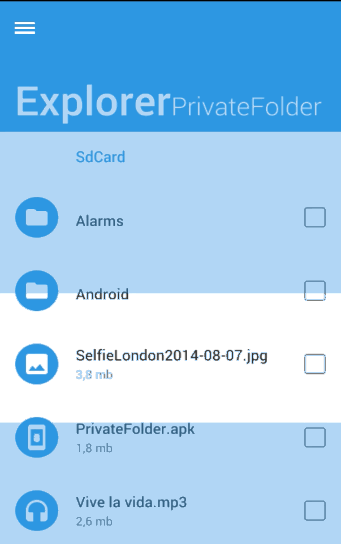

# Border Menu

<a href="https://play.google.com/store/apps/details?id=com.gc.demobordermenu">
  
</a>



## How to use

If you want use this library, you only have to download BorderMenu project, import it into your workspace and add the project as a library in your android project settings.

If you prefer it, you can use the gradle dependency, you have to add these lines in your build.gradle file:

```xml
repositories {
    jcenter()
}

dependencies {
    compile 'com.github.navasmdc:bordermenu:1.1@aar'
    compile 'com.android.support:support-v4:22.+'
    compile 'com.nineoldandroids:library:2.4.+'
}
```

>This library support Android 2.2

To add this menu in your activities, these have to extends of `BorderMenuActivity`

> BorderMenuActivity extends of FragmentActivity, if you need use fragments in your activity.

## Configuration

You can configure some elements of this Menu:

#####Menu color:
You can change the color menu by calling this function:

```java
	setMenuColor(int color);
```

#####Menu icon color:
You can change the color icon menu by calling this function:

```java
	setMenuIconColor(int color);
```

#####Hide menu by touching out
You can configure the menu for hide it when the user will be touch out of it:

```java
	setHidedOnTouchOutside(boolean bool);
```

#####Show/Hide the menu icon
You can show or hide the menu icon whenever you want by calling these functions:

```java
	showIconMenu();
	
	hideIconMenu()
```

#####Show/Hide the menu
You can show or hide the menu icon whenever you want by calling these functions:

```java
	showMenu();
	
	hideMenu()
```

>You can know if the menu if showed by calling to function
>`isMenuShowed()`

## Items
#####Icon item


```java
new IconItem(Context context, int id, int drawable);
```

When you generate a IconItem you've to set an id for detect it in the event listener and a drawable resource for the icon.

#####Text item


```java
new TextItem(Context context, int id, String text,int color);
```

When you generate a TextItem you've to set an id for detect it in the event listener,a string for the text and the color of the text.

#####Interaction with the items

#####Add items

For add items to the menu bars, you can call to these functions:


```java
	addTopItem(MenuItem item);
	
	addLeftItem(IconItem item);
```

> The left menu bar only allow add IconItems

#####Get items

For get items on the menu bars, you can call to this function:


```java
	getItemById(int id);
```


#####Remove items

For remove items on the menu bars, you can call to these functions::


```java
	removeTopItem(int id);
	
	removeLeftItem(int id);
	
	removeAllTopItems();
```

#####Item click listener

For detect the click on the items, you've to overwrite this function:


```java
	@Override
	public void onItemClick(int id) { }
```


For more information see [MainActivity](DemoBorderMenu/src/com/gc/demobordermenu/activities/MainActivity.java) of BorderMenuDemo project.

